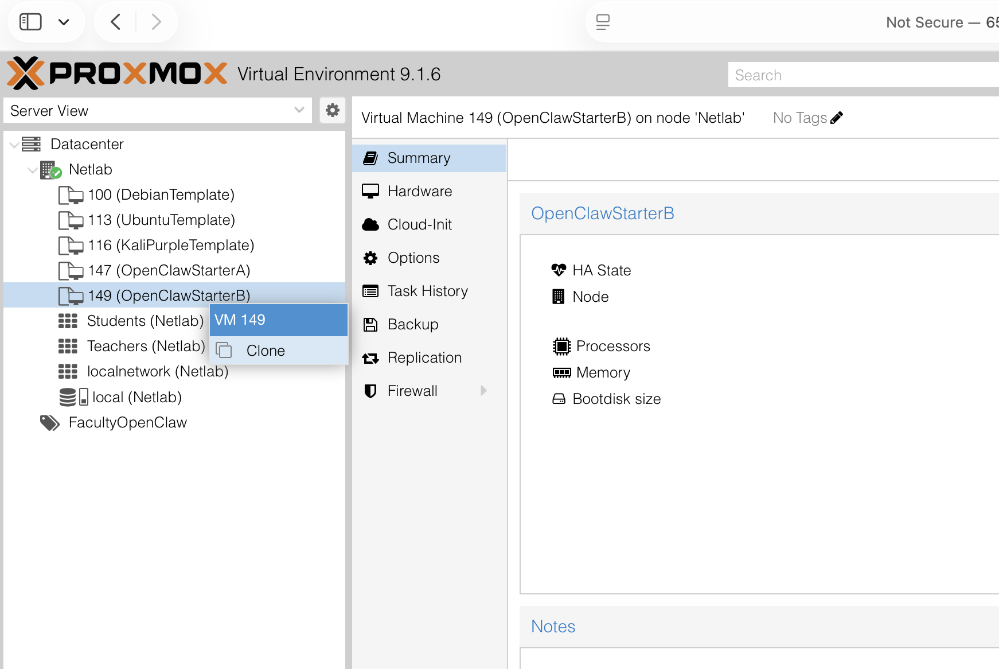
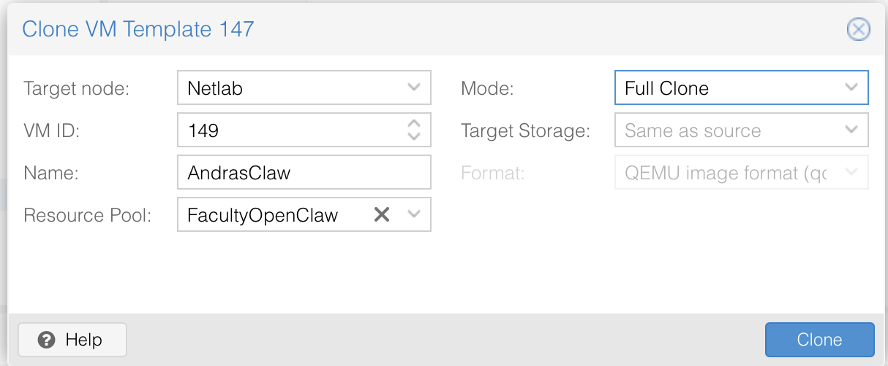
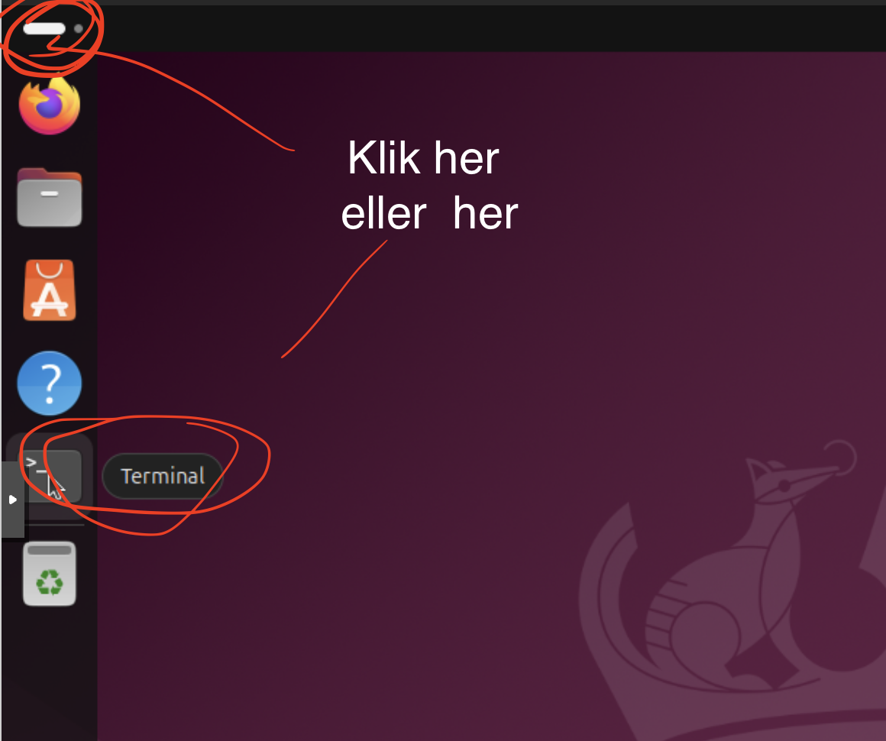
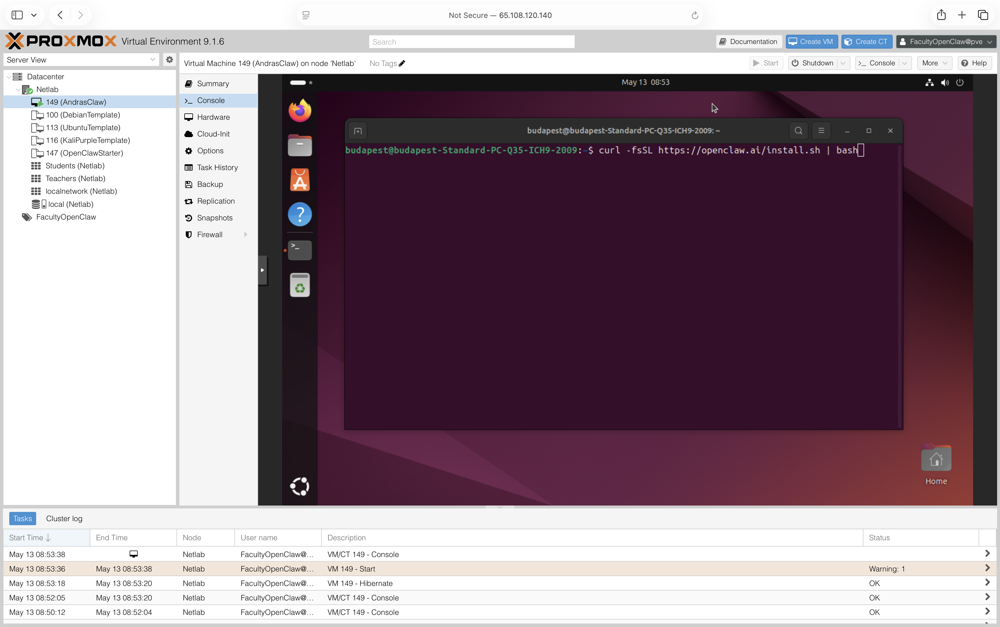

# Vejledning: Kom i gang med OpenClaw på Netlab

Denne vejledning guider dig igennem opsætning af din egen OpenClaw-instans på Netlab (Proxmox).
Du skal bruge adgang til Netlab og ca. 5 minutter.

---

## Trin 1 — Klon en OpenClaw-skabelon

Åbn Proxmox og find **OpenClawStarterB** (VM 149) under *Students (Netlab)*.

Højreklik på VM'en og vælg **Clone**.



---

## Trin 2 — Indstil din klon

Udfyld klone-dialogen sådan her:

| Felt | Værdi |
|------|-------|
| **Target node** | Netlab |
| **VM ID** | tildeles automatisk |
| **Name** | *DitNavnClaw* (fx `AndrasClaw`) |
| **Resource Pool** | FacultyOpenClaw |
| **Mode** | Full Clone |
| **Target Storage** | Same as source |

Klik **Clone** for at oprette din VM.



> Din VM starter automatisk og er klar om ca. 1 minut.

---

## Trin 3 — Åbn konsollen og terminalen

Gå til din nye VM i Proxmox og klik på **Console** øverst.

Inde i det Ubuntu-skrivebord der åbner, skal du starte en terminal.
Du kan enten klikke på **Terminal-ikonet** i proceslisten nederst — eller højreklikke på skrivebordet.



---

## Trin 4 — Installér OpenClaw

I terminalen kører du denne ene kommando:

```bash
curl -fsSL https://openclaw.at/install.sh | bash
```

Installationen starter og sætter OpenClaw op automatisk.



Følg instruktionerne på skærmen — du bliver bedt om at forbinde OpenClaw til din Telegram-konto.

---

## Færdig

Når installationen er gennemført, kan du styre OpenClaw direkte fra Telegram.
Prøv at sende en besked og se hvad der sker.

God fornøjelse!
